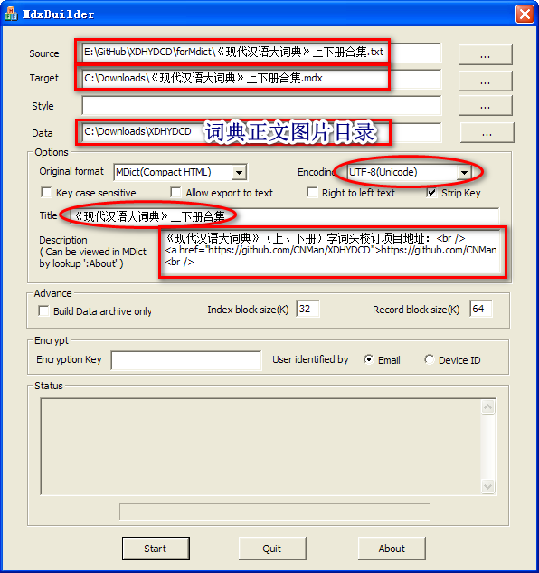
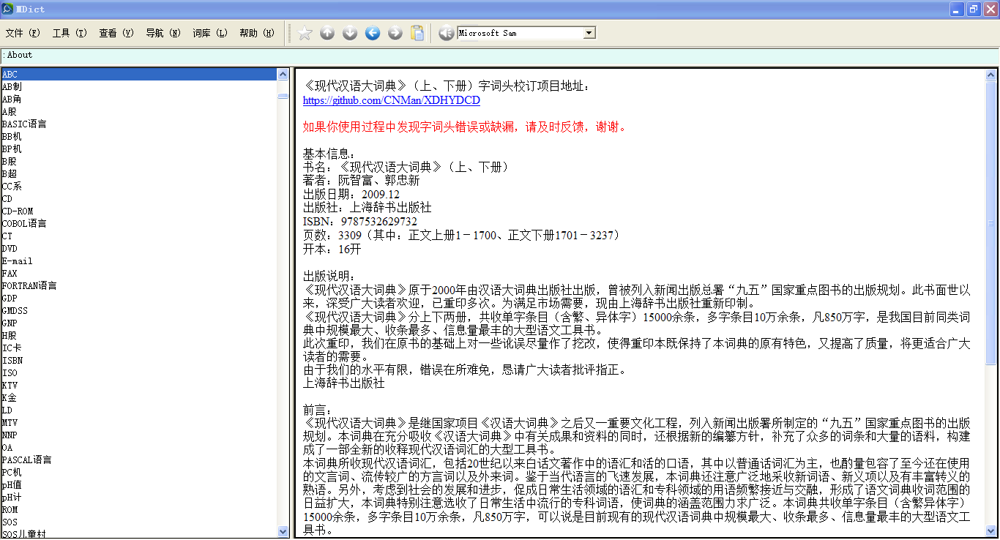
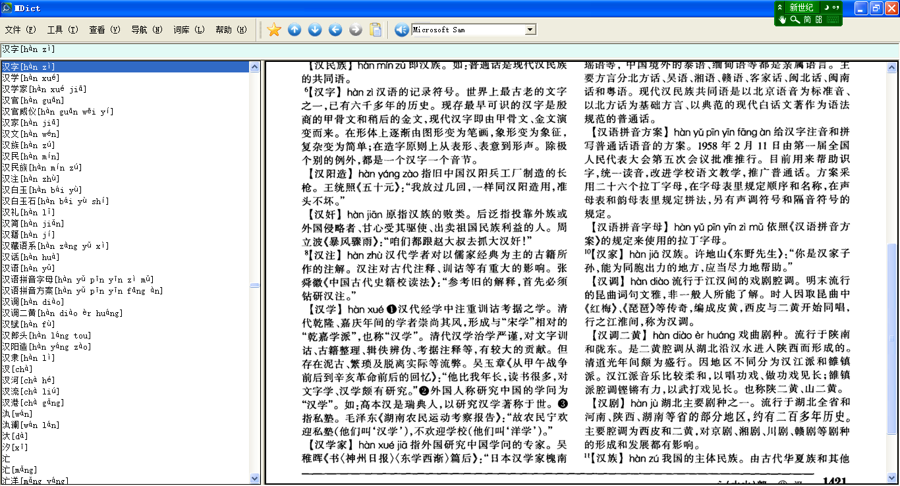

## 使用说明

1. 下载词典扫描版PDF
2. 将词典正文页导出为PNG图片（软件推荐[PDF 补丁丁](https://www.cnblogs.com/pdfpatcher/)），并按顺序命名为0001.png……3237.png
3. 用[MdxBuilder](https://www.mdict.cn/)制作词典，设置如图所示：
  1. Source:`《现代汉语大词典》上下册合集.txt`
  2. Target:输出的词典目录及文件名
  3. Data:词典正文图片目录
  4. Encoding:UTF-8(Unicode)
  5. Title:《现代汉语大词典》上下册合集
  6. Description:`词典说明.txt`中的内容复制进来即可

## 词典展示

